# Runtime Frost — Online Store Interface (React + Redux)

A fully functional e-commerce frontend built with React and Redux. Includes product catalog, filtering, authentication, cart management, order history, and responsive UI with dark/light theme support.

## Features

- **Dynamic Product Catalog** — Fetches products via Axios from an external API.
- **Product Cards** — Includes product descriptions, availability, and user reviews.
- **Advanced Filtering** — Filter by brands, models, and generations.
- **Authentication** — User registration and login with token-based auth and protected routes.
- **Global State Management** — Implemented with Redux for scalable architecture.
- **Asynchronous Logic** — Handled via Redux middleware (e.g. Redux Thunk).
- **Modal Management** — Custom React hooks for modals.
- **Routing** — SPA navigation with React Router (home, cart, product pages, user dashboard).
- **Shopping Cart** — Add/remove items and adjust quantities.
- **Checkout Flow** — Contact form with error validation and order confirmation.
- **User Dashboard** — Displays order history.
- **Responsive Design** — TailwindCSS layout with full mobile/tablet support.
- **Dark/Light Theme** — Toggle between UI themes seamlessly.

## Tech Stack

- **Frontend**: JavaScript, HTML, CSS, React, Redux, React Router, Axios, Tailwind CSS

## Screenshots

### Home Page
Displays a clean and responsive product grid. Each product card includes image, price, title, and a quick action button.

  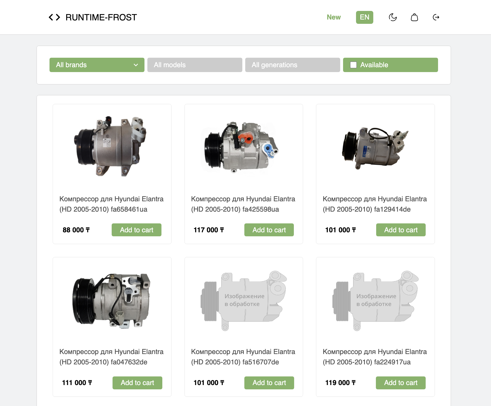
  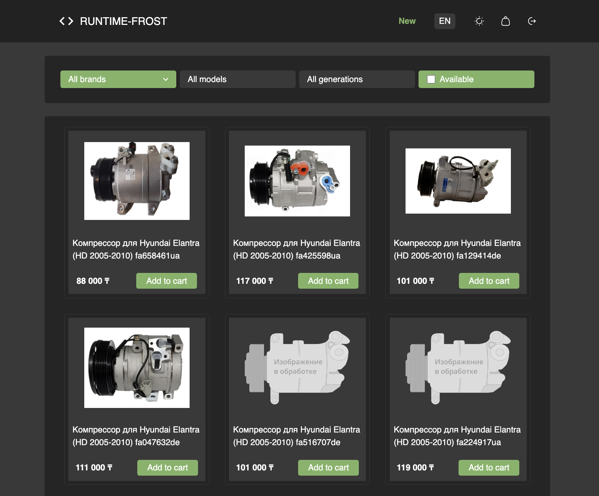

### Filtering Panel
Filter products by brand, model, or generation. The UI updates dynamically based on selected filters.

  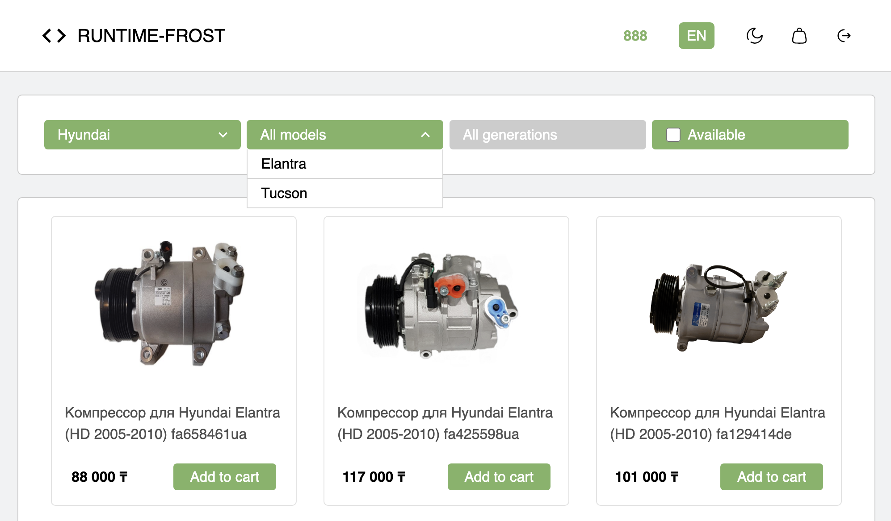
  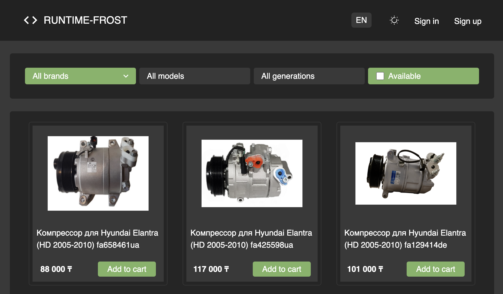

### Product Card  
Detailed product view including description, specifications, user reviews, price, and availability status. The design is responsive and user-friendly.

  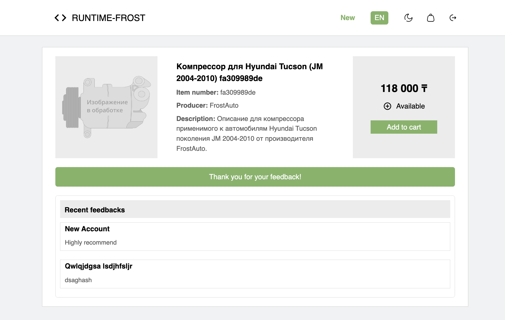
  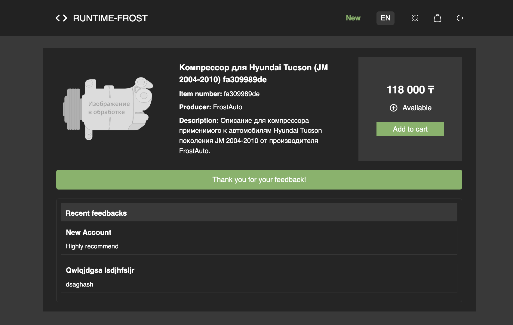

### Shopping Cart
Easily add and remove items, adjust quantities, and proceed to checkout. The total amount updates automatically.

  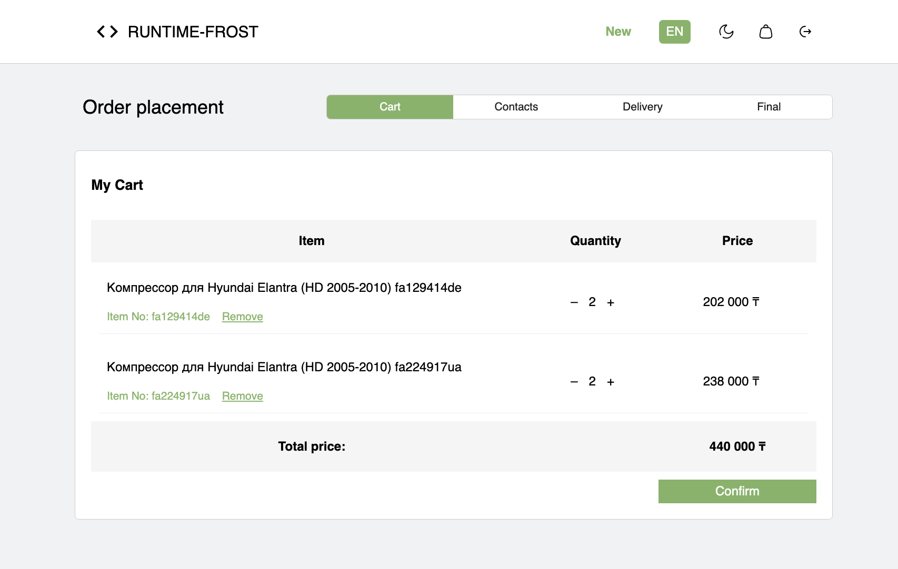
  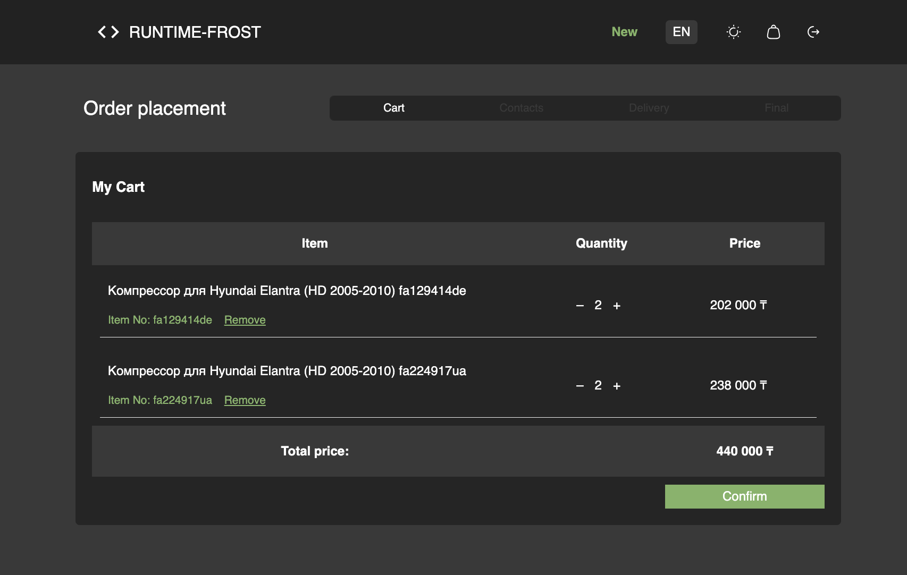

### Checkout Form  
Form for entering contact details and delivery information to finalize the order. Includes validation and helpful error messages for incorrect inputs.

  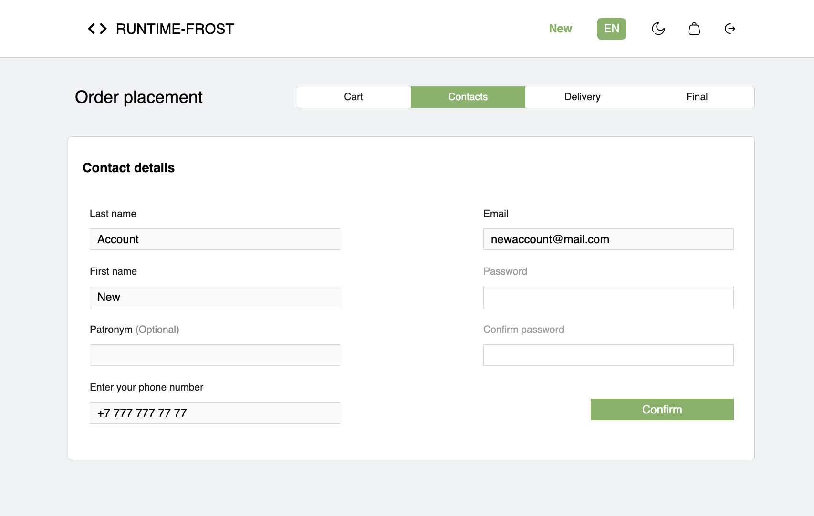
  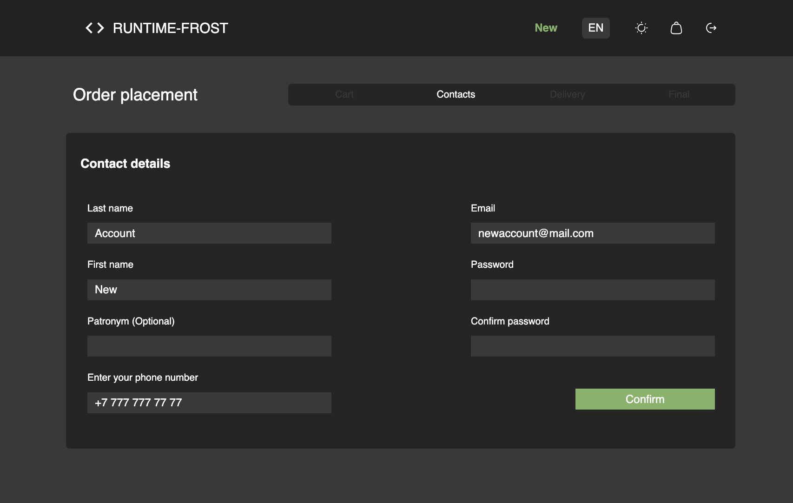

### Login & Registration
Secure user authentication with email and password. Protected routes redirect unauthenticated users.

  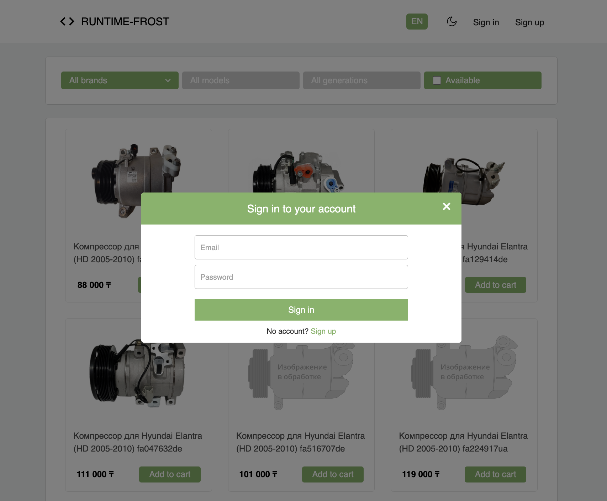
  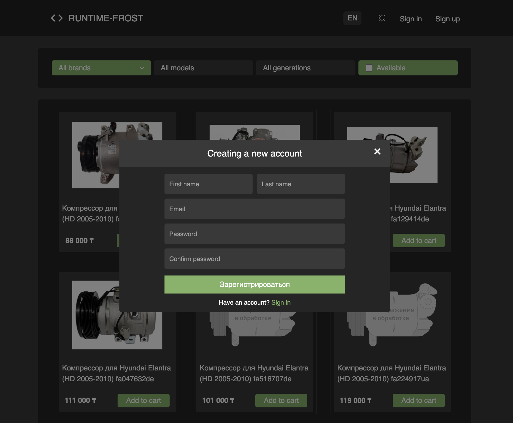

### User Dashboard
View order history in the dashboard.

  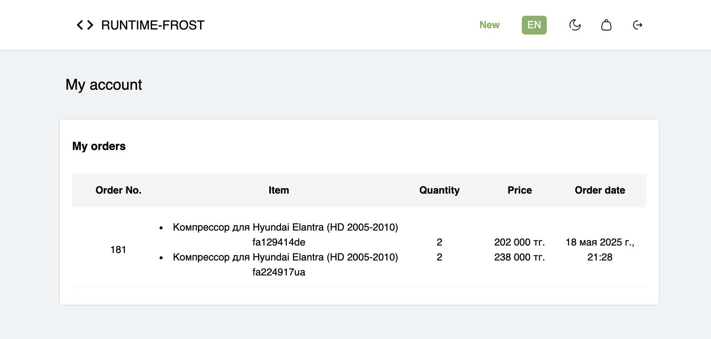
  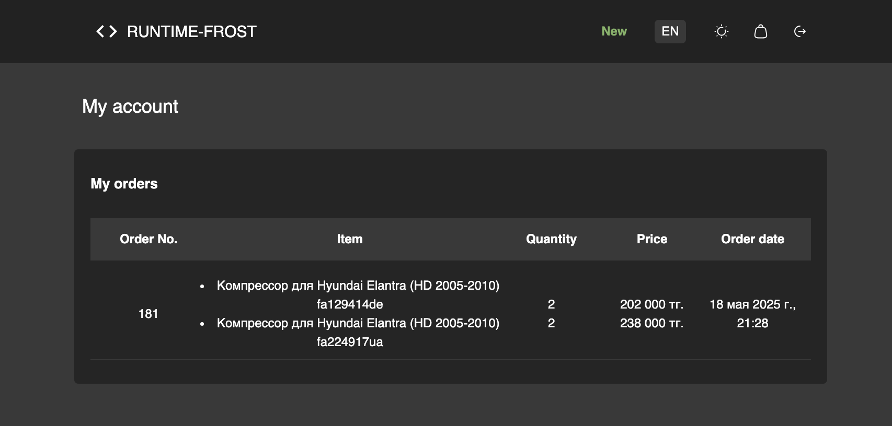

